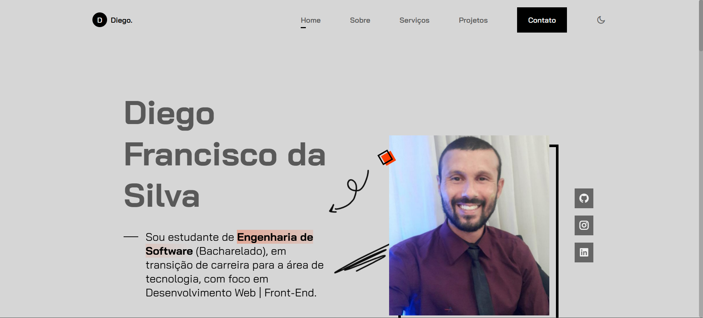
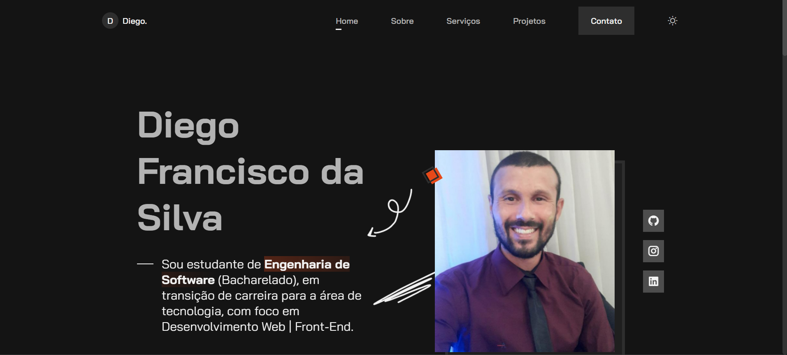

# Portfólio Pessoal | Diego Francisco da Silva

  
  

## 📄 Descrição

Este é o meu portfólio pessoal e profissional, desenvolvido para apresentar meus projetos, habilidades e serviços na área de **Desenvolvimento Web** e **Front-End**. O projeto foi construído com foco em design responsivo, acessibilidade e uma experiência de usuário fluida.

O site serve como meu cartão de visita digital, onde recrutadores e clientes podem conhecer meu trabalho e entrar em contato diretamente.

---

## 🚀 Tecnologias Utilizadas

O projeto foi desenvolvido utilizando as seguintes tecnologias e ferramentas:

- **HTML5**: Estruturação semântica do conteúdo.
- **CSS3**: Estilização avançada com Flexbox, CSS Grid, Variáveis CSS (Custom Properties) e Media Queries.
- **JavaScript (ES6+)**: Lógica para interações, menu mobile, tema escuro/claro e links ativos.
- **[Remix Icon](https://remixicon.com/)**: Biblioteca de ícones utilizada para interface e redes sociais.
- **[ScrollReveal.js](https://scrollrevealjs.org/)**: Biblioteca para animações suaves de entrada dos elementos ao rolar a página.
- **[Google Fonts](https://fonts.google.com/)**: Fonte _Bai Jamjuree_ para tipografia moderna.

---

## ⚙️ Funcionalidades

- **📱 Design Totalmente Responsivo**:
  - Layout _Mobile First_ que se adapta perfeitamente a tablets e desktops.
  - Ajustes específicos de Grid para telas intermediárias (tablets).

- **🌗 Tema Dark/Light (Escuro/Claro)**:
  - Alternância de tema com persistência de dados (o site "lembra" a preferência do usuário usando `localStorage`).

- **✨ Animações e Interatividade**:
  - Menu _hamburguer_ para dispositivos móveis com animação de entrada.
  - _Scroll Reveal_: Elementos surgem suavemente conforme a página é rolada.
  - _Active Link_: O item do menu correspondente à seção visível na tela é destacado automaticamente.
  - Botão "Voltar ao Topo" que aparece dinamicamente.

- **📧 Formulário de Contato**:
  - Configurado com `FormSubmit.co` para envio rápido da mensagem do usuário, facilitando o contato rápido.

---

## 🎨 Layout e Seções

O site está dividido nas seguintes seções:

1.  **Home**: Apresentação inicial com foto, breve descrição e redes sociais.
2.  **Sobre**: Detalhes sobre minha trajetória, foco em Engenharia de Software e Skills.
3.  **Serviços**: Área destacando o que ofereço (Front-End, Development, Mobile App).
4.  **Projetos**: Galeria (Grid) mostrando trabalhos realizados com links para repositório e deploy.
5.  **Contato**: Formulário funcional e links alternativos para redes sociais.

---

## 👨‍💻 Autor

**Diego Francisco da Silva**

Desenvolvedor Front-End em formação e estudante de Engenharia de Software.

- **[LinkedIn](https://www.linkedin.com/in/diego-francisco-da-silva/)**: diego-francisco-da-silva
- **[GitHub](https://github.com/diegofranciscodasilva)**: diegofranciscodasilva
- **[Instagram](https://www.instagram.com/diego_francisco_da_silva/)**: @diego_francisco_da_silva

---

Feito com ❤️ por Diego.

